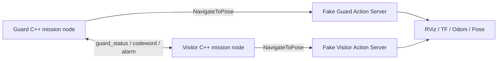

# Wachroboter ROS 2

A two-robot guard/visitor mission implemented with **ROS 2 Jazzy**, **C++**, ROS 2 topics, and the `NavigateToPose` action.

The project was originally developed for physical Volksbot mobile robots in a university robotics lab. This repository contains a **portable simulation backend** so the same C++ mission logic can be demonstrated without access to the lab hardware.

## Mission

Two robots cooperate around a guarded storage area:

- **Guard** moves to `GUARD_POSITION` and publishes `GUARD_READY`.
- **Visitor** moves to `VISITOR_STOP` and sends a codeword.
- If the code is correct (`OPEN123`), the Guard moves to `GUARD_CLEAR`, publishes `PATH_CLEAR`, and the Visitor moves to `LAGER`.
- If the code is wrong, the Guard publishes `DENIED`, publishes `alarm=true`, and moves to `POLIZEI`. The Visitor remains at `VISITOR_STOP`.

## Architecture



The important design choice is that the **C++ mission node is unchanged**. In the lab, its `NavigateToPose` client talked to Nav2 on a physical robot. In this repository, the same action interface is implemented by `fake_robot_sim.py`.

## ROS 2 mission interface

| Topic | Type | Main direction | Purpose |
|---|---|---|---|
| `/wachroboter/codeword` | `std_msgs/msg/String` | Visitor → Guard | Sends `OPEN123` or another codeword |
| `/wachroboter/guard_status` | `std_msgs/msg/String` | Guard → Visitor | `GUARD_READY`, `PATH_CLEAR`, `DENIED` |
| `/wachroboter/alarm` | `std_msgs/msg/Bool` | Guard → system | `true` when access is denied |

Navigation uses the ROS 2 action:

```text
nav2_msgs/action/NavigateToPose
```

## Repository structure

```text
wachroboter-ros2/
├── wachroboter/                  # ROS 2 C++ mission package
│   ├── src/wachroboter_node.cpp
│   ├── config/mission.yaml
│   ├── CMakeLists.txt
│   └── package.xml
├── simulation/
│   ├── fake_robot_sim.py         # lightweight NavigateToPose action server
│   ├── rviz_labels.py
│   └── topic_monitor.py
├── scripts/
│   ├── run_demo.sh
│   └── stop_demo.sh
├── maps/
│   ├── synthetic_warehouse.yaml
│   └── synthetic_warehouse.pgm
├── rviz/wachroboter_sim.rviz
└── examples/
```

## Requirements

Target environment:

- Ubuntu 24.04
- ROS 2 Jazzy
- `colcon`
- `rclcpp`
- `rclcpp_action`
- `nav2_msgs`
- `nav2_map_server`
- `rclpy`
- `tf2_ros`
- `rviz2`

The simulation does **not** require physical robot hardware.

## Build

Clone the repository into a ROS 2 workspace:

```bash
mkdir -p ~/ros2_ws/src
cd ~/ros2_ws/src
git clone https://github.com/dotschmann/wachroboter-ros2.git

cd ~/ros2_ws
source /opt/ros/jazzy/setup.bash
colcon build --packages-select wachroboter
source install/setup.bash
```

## Run the correct-code scenario

```bash
cd ~/ros2_ws/src/wachroboter-ros2
bash scripts/run_demo.sh correct
```

Expected mission exchange:

```text
GUARD_READY
OPEN123
PATH_CLEAR
```

The Visitor then moves to `LAGER`.

## Run the wrong-code scenario

```bash
cd ~/ros2_ws/src/wachroboter-ros2
bash scripts/run_demo.sh wrong
```

Expected mission exchange:

```text
GUARD_READY
WRONG123
DENIED
alarm=true
```

The Guard moves to `POLIZEI` while the Visitor remains at `VISITOR_STOP`.

Press `Ctrl+C` to stop a running demo. You can also run:

```bash
bash scripts/stop_demo.sh
```

For a headless run without RViz:

```bash
NO_RVIZ=1 bash scripts/run_demo.sh correct
```

## Mission coordinates

| Position | x | y | yaw |
|---|---:|---:|---:|
| `GUARD_POSITION` | -1.185 | -0.100 | -3.012 |
| `VISITOR_STOP` | -1.850 | 1.442 | -1.655 |
| `GUARD_CLEAR` | -0.349 | -0.731 | -2.468 |
| `LAGER` | 0.343 | 1.442 | -1.655 |
| `POLIZEI` | -2.001 | 6.053 | 3.047 |

## What the simulator does

`simulation/fake_robot_sim.py` provides a lightweight `NavigateToPose` Action Server for each artificial robot. It:

- accepts navigation goals from the C++ mission node;
- rotates toward the target;
- updates the robot's x/y position step by step;
- rotates to the requested final yaw;
- publishes pose, odometry, TF and simulated velocity;
- publishes a simplified clear `LaserScan`;
- reports the action as `SUCCEEDED` when the destination is reached.

The C++ mission therefore waits for the navigation result before it advances to the next mission state.

## Simulation limitations

This is intentionally a lightweight mission simulation, not a physics simulator. In particular:

- the synthetic LaserScan reports clear space rather than ray-casting real obstacles;
- there is no Nav2 planner/controller stack in the portable simulation;
- collision avoidance and physical motor behavior are therefore not evaluated here.

The physical lab version used Nav2, robot odometry, LiDAR, TF and Volksbot hardware. The simulator exists to make the **mission protocol and state logic reproducible outside the laboratory**.

## License

Apache-2.0.
